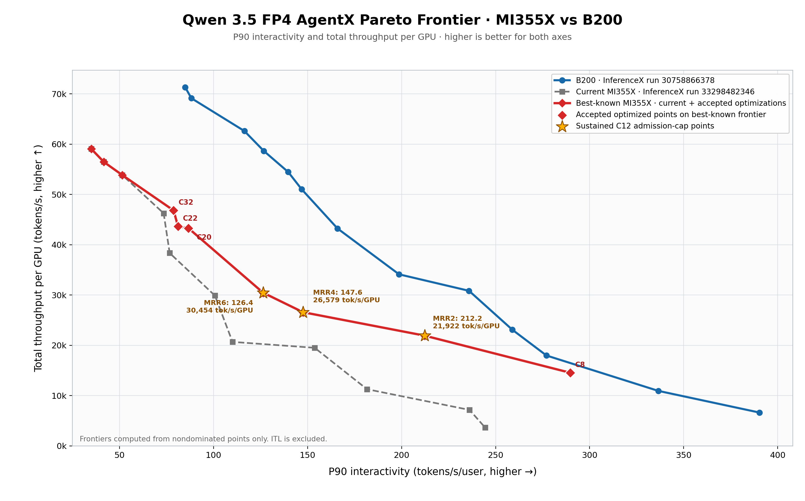

# Qwen 3.5 AgentX optimization on MI355X

This repository freezes the validated Qwen 3.5 FP4 AgentX performance campaign
completed on 2026-09-02. The objective uses only total throughput per GPU and
P90 full-response interactivity; ITL is intentionally excluded.

## Headline result

The agreed objective was to improve the arithmetic mean of P90 interactivity
across 12 frozen MI355X Pareto throughput floors by at least 20%, without
lowering any floor. The accepted portfolio achieved it:

| Metric | Frozen frontier | Accepted frontier | Change / requirement |
|---|---:|---:|---:|
| Mean P90 interactivity | 119.92649667 tok/s/user | 144.16638167 tok/s/user | **+20.212285%** |
| Required mean | - | 143.91179600 tok/s/user | passed by 0.25458567 |
| Throughput-floor regressions | 0 | 0 | none allowed |
| Provisional points used | 0 | 0 | none allowed |

Individual anchors were not required to move 20%. The evaluator selects the
best accepted P90 value at or above each frozen throughput floor, then averages
all 12 selected values. Six anchors improved and six retained their existing
accepted result.

The final point that crossed the aggregate target is TP2/EP1 C12 with
`max-running-requests=6`, decode graph capacity 24, scheduler receive interval
30, and page size 16:

| Metric | Accepted MI355X maxrun-6 |
|---|---:|
| Total throughput/GPU | 30,453.91358 tok/s |
| P90 full-response interactivity | 126.37218 tok/s/user |
| Measured duration | 3,622.06436 s |
| Profiled requests / errors | 2,206 / 0 |
| Average power | 697.084 W/GPU |



## Reproduce the result

The checked-in accepted portfolio is independently evaluated with:

```bash
python3 scripts/evaluate_frontier_objective.py \
  --candidates data/qwen35_frontier_accepted_portfolio_20260902.json \
  --require-target
```

This must report `objective_achieved=1`, `uses_provisional=0`, and
`relative_mean_gain_pct=20.212285`.

## Source requirements

The original maxrun-4 scheduling result needs no unmerged source patch. The new
low-concurrency frontier results use checksum-pinned overlays from SGLang
#35872 and #37465 plus AITER #5190. Those three PRs were still open when their
status was rechecked on 2026-09-02, so reproducing the accepted portfolio
currently requires the checked-in patches. See `docs/UPSTREAM_STATUS.md` for
the exact benchmarked heads and current upstream heads.

## Contents

- `docs/RESULTS.md`: accepted aggregate result, selected anchors, final-point
  validation, and B200/MI355X context.
- `docs/REPRODUCE.md`: exact evaluator, chart, qualification, confirmation, and
  postflight workflow.
- `docs/SOURCE_PROVENANCE.md`: frozen source/model pins and artifact origins.
- `docs/UPSTREAM_STATUS.md`: merged dependencies and remaining upstream work.
- `docs/NEXT_FRONTIER_OBJECTIVE.md`: the frozen objective definition and the
  completed acceptance record.
- `scripts/`: benchmark, archival, audit, plotting, and frontier-evaluation
  tools used by the campaign.
- `data/`: frozen objective, accepted portfolio/evaluation, audited runner
  aggregates, and compact maxrun-6 evidence.
- `patches/`: checksum-pinned SGLang and AITER benchmark overlays.
- `artifacts/`: dated Pareto charts and complete point-level CSVs.
- `SHA256SUMS`: integrity manifest for the published payload.

The multi-gigabyte raw benchmark archives remain on AAC17 shared storage. Their
canonical paths and validation evidence are recorded in
`docs/SOURCE_PROVENANCE.md`.
