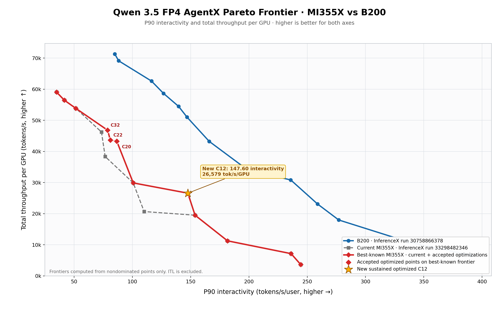

# Qwen 3.5 AgentX optimization on MI355X

This repository freezes the validated Qwen 3.5 FP4 AgentX performance handoff
from the MI355X tuning campaign completed on 2026-09-01. The optimization
objective uses total throughput per GPU and P90 full-response interactivity;
ITL is intentionally excluded.

## Headline result

The accepted TP2/EP1 concurrency-12 point uses `max-running-requests=4` with a
decode graph capacity of 24:

| Metric | Accepted MI355X | Current MI355X reference | Matching B200 |
|---|---:|---:|---:|
| Total throughput/GPU | 26,579.15484 tok/s | 29,878.60324 tok/s | 29,755.23348 tok/s |
| P90 interactivity | 147.60291 tok/s/user | 100.76418 tok/s/user | 145.60570 tok/s/user |

This is 89.325983% of B200 throughput and 101.371656% of B200 P90
interactivity. Relative to the current MI355X runner point, it trades 11.042847%
throughput for 46.483512% higher P90 interactivity and remains on the observed
Pareto frontier.

## Contents

- `docs/RESULTS.md`: accepted metrics, configuration, evidence gates, and
  comparison details.
- `docs/REPRODUCE.md`: exact benchmark and chart reproduction workflow.
- `docs/SOURCE_PROVENANCE.md`: frozen source/model pins and artifact origins.
- `docs/UPSTREAM_STATUS.md`: merged upstream work and remaining data-only work.
- `scripts/`: the exact C12 launch, bracket, confirmation, archival, postflight,
  and plotting tools.
- `data/`: aggregate JSON records from the two audited InferenceX runners used
  by the chart.
- `artifacts/`: the accepted chart and its complete point-level CSV.
- `SHA256SUMS`: integrity manifest for the published payload.

The full multi-gigabyte benchmark archive is intentionally not duplicated here.
Its canonical AAC17 path and validation details are recorded in
`docs/SOURCE_PROVENANCE.md`.
